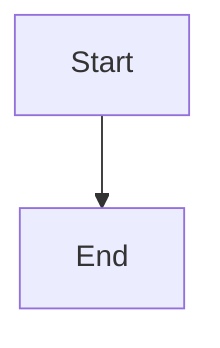

# Mermaid Diagram Generator

Generate precise Mermaid syntax for any visualization need: architecture, workflows, sequences, data models, timelines, mindmaps, and more. Supports 20+ diagram types with correct syntax and styling.

## When to Use

- Visualizing system architecture, data flows, or infrastructure
- Creating flowcharts for processes, decisions, or workflows
- Sequence diagrams for API calls, service interactions, or protocols
- Entity-relationship diagrams for data models
- Class diagrams for object hierarchies
- Gantt charts, timelines, or project schedules
- Mindmaps for brainstorming or knowledge organization
- Any request mentioning: diagram, flowchart, sequence, ERD, mermaid, 다이어그램, 플로차트

## Generation Workflow (2 Phases)

> **You are an adaptive diagram agent.** Every diagram should be uniquely shaped by its content, audience, and purpose. Diagram type, layout direction, detail level, and styling must all adapt to context -- never produce generic output. Analyze what truly needs visualizing before selecting a diagram type.

### Phase 1: Content Analysis (plan before generating)

1. **Analyze** the subject matter -- what relationships, flows, or structures need visualization
2. **Select diagram type** using the Decision Matrix below
3. **Determine layout direction** (TD, LR, RL, BT) based on content flow
4. **Plan node structure** -- identify entities, relationships, groupings
5. **Choose styling** -- theme, colors, class definitions

### Phase 1 Output Format

Before generating Mermaid syntax, output this planning summary:

| Aspect | Decision |
|--------|----------|
| Subject | What is being visualized |
| Diagram Type | Selected type and why |
| Direction | TD / LR / RL / BT (if applicable) |
| Key Entities | Main nodes or actors (5-15) |
| Groupings | Subgraphs or clusters |
| Theme | default / forest / dark / neutral / base |

### Phase 2: Mermaid Syntax Generation

1. Load `references/diagram-types.md` for the selected diagram type syntax
2. Write syntactically correct Mermaid code
3. Apply styling from `references/theme-config.md` if customization is needed
4. Validate against the checklist below
5. Output in the requested format (.md code block, .mmd file, or HTML)

## Diagram Type Decision Matrix

| What You Need to Show | Diagram Type | Direction |
|----------------------|--------------|-----------|
| Process / workflow / decisions | `flowchart` | TD or LR |
| API calls / service interactions | `sequenceDiagram` | -- |
| Data models / table relationships | `erDiagram` | -- |
| Class hierarchy / interfaces | `classDiagram` | -- |
| Object states / transitions | `stateDiagram-v2` | -- |
| Project schedule / task timeline | `gantt` | -- |
| User experience steps | `journey` | -- |
| Git branch strategy | `gitGraph` | -- |
| Proportional data | `pie` | -- |
| Hierarchical concepts | `mindmap` | -- |
| Chronological events | `timeline` | -- |
| 2D category analysis | `quadrantChart` | -- |
| System context (C4) | `C4Context` | -- |
| Container architecture (C4) | `C4Container` | -- |
| Component detail (C4) | `C4Component` | -- |
| Block-based layout | `block-beta` | -- |
| Flow volumes / distributions | `sankey-beta` | -- |
| Numeric data / charts | `xychart-beta` | -- |
| Requirements traceability | `requirement` | -- |
| Alternative sequence syntax | `zenuml` | -- |
| Infrastructure / cloud architecture | `architecture-beta` | -- |
| Task board / kanban | `kanban` | -- |

**Selection heuristic:** When multiple types could work, prefer the one that most directly maps to the data structure. For example, use `erDiagram` for data models even if a `classDiagram` could technically represent the same thing.

## Diagram Type Quick Reference

| Type | Use Case | Complexity | Notes |
|------|----------|------------|-------|
| `flowchart` | Processes, decisions, workflows | Low | Most versatile; supports subgraphs |
| `sequenceDiagram` | API calls, message passing | Low | Actors + messages; supports loops/alt |
| `erDiagram` | Database schema, data models | Low | Entities + relationships with cardinality |
| `classDiagram` | OOP design, interfaces | Medium | Methods, attributes, inheritance |
| `stateDiagram-v2` | State machines, lifecycles | Medium | States, transitions, forks, joins |
| `gantt` | Project timelines, schedules | Low | Tasks, sections, dependencies |
| `journey` | User experience mapping | Low | Steps with satisfaction scores |
| `gitGraph` | Branch strategies | Low | Commits, branches, merges |
| `pie` | Proportional data | Low | Simple label/value pairs |
| `mindmap` | Brainstorming, concept maps | Low | Indentation-based hierarchy |
| `timeline` | Chronological events | Low | Time periods with events |
| `quadrantChart` | 2D categorization | Medium | Four-quadrant analysis |
| `C4Context` | System-level architecture | Medium | C4 model level 1 |
| `C4Container` | Container architecture | Medium | C4 model level 2 |
| `C4Component` | Component detail | High | C4 model level 3 |
| `block-beta` | Custom block layouts | Medium | Grid-based positioning |
| `sankey-beta` | Flow distributions | Medium | Weighted connections |
| `xychart-beta` | Bar/line charts | Low | Numeric x/y data |
| `requirement` | Requirements tracing | Medium | Requirements + elements + relationships |
| `zenuml` | Sequence (alt syntax) | Low | Code-like sequence syntax |
| `architecture-beta` | Cloud infrastructure | Medium | Services + groups + edges |
| `kanban` | Task boards | Low | Columns with items |

## Output Formats

### 1. Markdown Code Block (default)

````markdown

````

Best for: README files, documentation, GitHub/GitLab rendering.

### 2. Standalone .mmd File

Write raw Mermaid syntax to a `.mmd` file (no code fences):
```
flowchart TD
    A[Start] --> B[End]
```

Best for: Mermaid CLI rendering, CI/CD pipelines, integration with other tools.

### 3. HTML with Mermaid CDN

```html
<!DOCTYPE html>
<html lang="en">
<head>
    <meta charset="UTF-8">
    <title>Diagram</title>
    <script type="module">
        import mermaid from 'https://cdn.jsdelivr.net/npm/mermaid@11/dist/mermaid.esm.min.mjs';
        mermaid.initialize({ startOnLoad: true, theme: 'default' });
    </script>
</head>
<body>
    <pre class="mermaid">
    flowchart TD
        A[Start] --> B[End]
    </pre>
</body>
</html>
```

Best for: Standalone viewing, sharing with non-technical audiences, presentations.

## Styling Quick Reference

### Built-in Themes

Apply via init directive at the top of the diagram:

```
%%{init: {'theme': 'forest'}}%%
flowchart TD
    A --> B
```

| Theme | Style | Best For |
|-------|-------|----------|
| `default` | Blue tones, light background | General purpose |
| `forest` | Green tones | Nature, growth, organic |
| `dark` | Dark background, light text | Dark mode UIs |
| `neutral` | Grayscale | Formal documents, print |
| `base` | Minimal, customizable | Custom theme base |

### Custom Node Styling

```
classDef highlight fill:#f9f,stroke:#333,stroke-width:2px
classDef error fill:#f44,stroke:#900,color:#fff

flowchart TD
    A[Normal]:::highlight --> B[Error]:::error
```

### Edge Styling

```
flowchart TD
    A -- "label" --> B
    A -. "dashed" .-> C
    A == "thick" ==> D
```

See `references/theme-config.md` for full styling options including custom theme variables.

## Syntax Rules (Critical)

1. **Node IDs must be alphanumeric** -- no spaces, hyphens, or special characters in IDs
   - OK: `nodeA`, `node_1`, `myNode`
   - BAD: `my-node`, `node 1`, `my.node`
2. **Text with special characters must be quoted** -- use `["text"]` for node labels containing parentheses, brackets, or special chars
3. **Subgraph IDs follow the same rules** as node IDs
4. **Direction declaration** must be on the first line after diagram type: `flowchart TD`
5. **One relationship per line** -- do not chain multiple arrows on one line when using labels
6. **Semicolons are optional** -- prefer newlines for readability
7. **Init directives** must be the very first line, before the diagram type declaration
8. **classDef** declarations go after all node/edge definitions
9. **Indentation** is ignored by the parser but improves readability -- use 4 spaces
10. **Comments** use `%%` prefix: `%% This is a comment`

## Validation Checklist

**After generating, copy this checklist and verify each item:**

```
[ ] Diagram type declaration is correct (flowchart, sequenceDiagram, etc.)
[ ] Direction specified where applicable (TD, LR, RL, BT)
[ ] All node IDs are valid (alphanumeric/underscore only)
[ ] All node labels with special characters are properly quoted ["..."]
[ ] Arrows use correct syntax (-->, ---, -.->,-..-, ==>, ==> for each type)
[ ] Subgraph blocks properly opened and closed (subgraph ... end)
[ ] Init directive (if used) is on the very first line
[ ] classDef declarations come after node/edge definitions
[ ] No duplicate node IDs within the same scope
[ ] Labels on edges are properly quoted where needed
[ ] Diagram renders without syntax errors (mentally trace the parse)
[ ] Complexity is appropriate -- not too many nodes (aim for 5-20 per diagram)
[ ] Output format matches user request (.md, .mmd, or .html)
```

## Common Mistakes

| | Pattern | Fix |
|---|---------|-----|
| ❌ | `my-node[Label]` -- hyphen in node ID | ✅ `myNode[Label]` or `my_node[Label]` |
| ❌ | `A[Click here (button)]` -- unquoted special chars | ✅ `A["Click here (button)"]` |
| ❌ | `flowchart TD` after `%%{init}%%` with blank line between | ✅ `%%{init}%%` immediately followed by diagram type (no blank line) |
| ❌ | `A --> B --> C` with labels on chained arrows | ✅ Separate lines: `A -->|"label1"| B` then `B -->|"label2"| C` |
| ❌ | `classDef` before node definitions | ✅ `classDef` after all nodes and edges are defined |
| ❌ | Missing `end` for subgraph blocks | ✅ Every `subgraph` must have a matching `end` |
| ❌ | `sequenceDiagram TD` -- direction on non-flowchart | ✅ Direction only applies to `flowchart` type |
| ❌ | Forgetting `participant` declarations in sequence diagrams | ✅ Declare participants for custom ordering and aliases |
| ❌ | Using `graph` instead of `flowchart` | ✅ Prefer `flowchart` (modern syntax with more features) |
| ❌ | 50+ nodes in a single diagram | ✅ Split into multiple diagrams or use subgraphs (aim for 5-20 nodes) |

## Reference Loading Guide

**Always read first:**
- This SKILL.md -- core workflow, decision matrix, and quick reference

**Load for diagram syntax:**
- `references/diagram-types.md` -- When generating any diagram type (load the relevant section)

**Load for styling decisions:**
- `references/theme-config.md` -- When customizing themes, colors, or node styles

## References

- `references/diagram-types.md` -- Complete syntax patterns for all 20+ diagram types
- `references/theme-config.md` -- Theme configuration, classDef, custom styling
