# Mermaid Diagram Types Reference

## Table of Contents

1. [Flowchart](#flowchart)
2. [Sequence Diagram](#sequence-diagram)
3. [Class Diagram](#class-diagram)
4. [State Diagram](#state-diagram)
5. [Entity Relationship Diagram](#entity-relationship-diagram)
6. [Gantt Chart](#gantt-chart)
7. [User Journey](#user-journey)
8. [Git Graph](#git-graph)
9. [Pie Chart](#pie-chart)
10. [Mindmap](#mindmap)
11. [Timeline](#timeline)
12. [Quadrant Chart](#quadrant-chart)
13. [C4 Diagrams](#c4-diagrams)
14. [Block Diagram](#block-diagram)
15. [Sankey Diagram](#sankey-diagram)
16. [XY Chart](#xy-chart)
17. [Requirement Diagram](#requirement-diagram)
18. [ZenUML](#zenuml)
19. [Architecture Diagram](#architecture-diagram)
20. [Kanban](#kanban)

---

## Flowchart

**Directions:** `TD` (top-down), `LR` (left-right), `RL` (right-left), `BT` (bottom-top)

**Node shapes:**
- `A[Rectangle]` -- standard
- `A(Rounded)` -- rounded rectangle
- `A([Stadium])` -- stadium/pill shape
- `A{Diamond}` -- decision
- `A{{Hexagon}}` -- hexagon
- `A[/Parallelogram/]` -- parallelogram
- `A((Circle))` -- circle
- `A>Asymmetric]` -- flag shape
- `A[\Trapezoid\]` -- trapezoid

**Edge types:**
- `-->` solid arrow, `---` solid line
- `-.->` dashed arrow, `-.-` dashed line
- `==>` thick arrow, `===` thick line
- `-->|"label"|` labeled arrow
- `--x` cross end, `--o` circle end

**Example:**
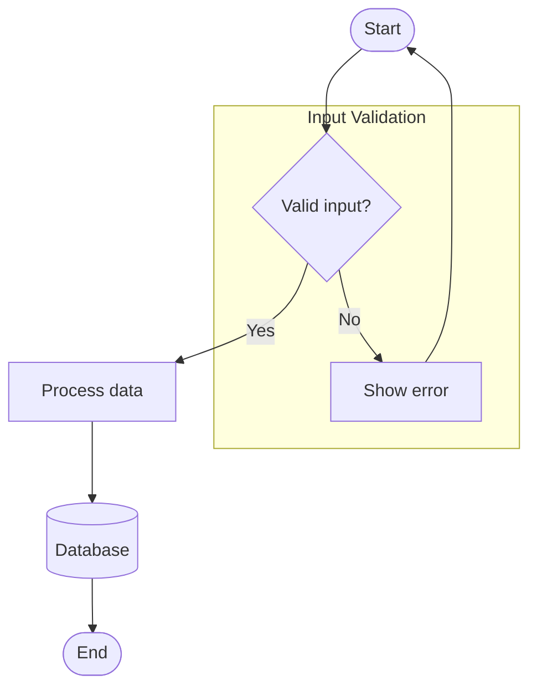
```mermaid
flowchart TD
    Start([Start]) --> Validate{Valid input?}
    Validate -->|Yes| Process[Process data]
    Validate -->|No| Error[Show error]
    Process --> Store[(Database)]
    Store --> Done([End])
    Error --> Start

    subgraph validation ["Input Validation"]
        Validate
        Error
    end
```

**Gotchas:**
- Use `flowchart` not `graph` (modern syntax)
- Node IDs cannot contain hyphens: use `myNode` not `my-node`
- Subgraph labels with spaces need quotes: `subgraph sg ["My Label"]`
- Database cylinder shape uses `[( )]`

---

## Sequence Diagram

**Key elements:** `participant`, `actor`, arrows, activation, loops, alt/opt/par blocks, notes

**Arrow types:**
- `->>` solid with arrowhead (request)
- `-->>` dashed with arrowhead (response)
- `-x` solid with cross (async/fire-and-forget)
- `-)` solid with open arrow (async)

**Example:**
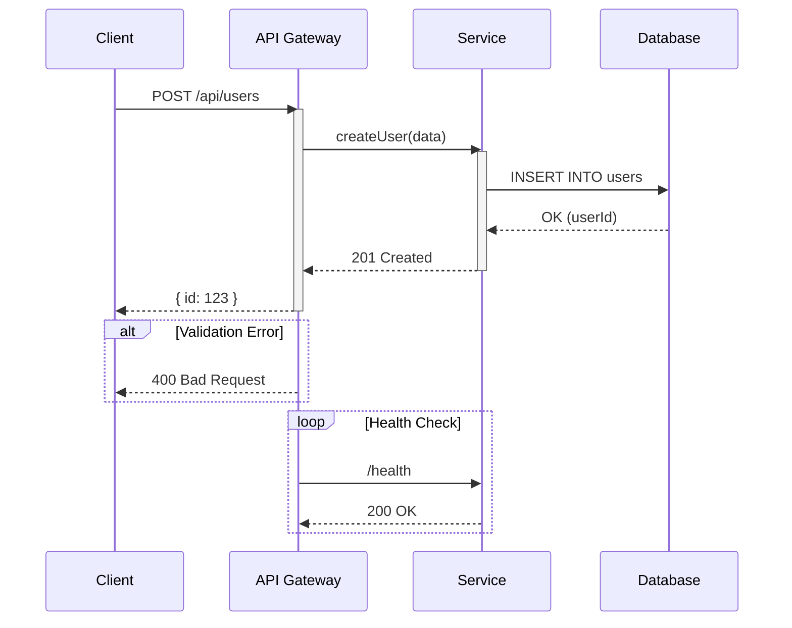
```mermaid
sequenceDiagram
    participant C as Client
    participant G as API Gateway
    participant S as Service
    participant D as Database

    C->>G: POST /api/users
    activate G
    G->>S: createUser(data)
    activate S
    S->>D: INSERT INTO users
    D-->>S: OK (userId)
    S-->>G: 201 Created
    deactivate S
    G-->>C: { id: 123 }
    deactivate G

    alt Validation Error
        G-->>C: 400 Bad Request
    end

    loop Health Check
        G->>S: /health
        S-->>G: 200 OK
    end
```

**Gotchas:**
- No direction declaration (no TD/LR)
- `participant` order determines left-to-right positioning
- Use `activate`/`deactivate` or `+`/`-` shorthand on arrows: `->>+` and `-->>-`
- Notes: `Note over A,B: text` or `Note right of A: text`

---

## Class Diagram

**Key elements:** classes, attributes, methods, relationships

**Relationships:**
- `<|--` inheritance
- `*--` composition
- `o--` aggregation
- `-->` association
- `..>` dependency
- `..|>` realization/implementation

**Visibility:** `+` public, `-` private, `#` protected, `~` package

**Example:**
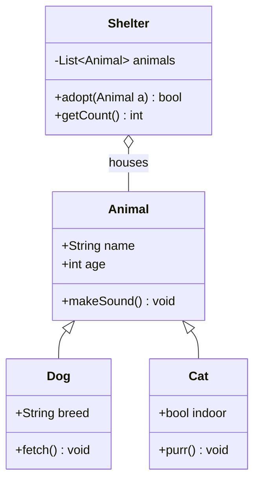
```mermaid
classDiagram
    class Animal {
        +String name
        +int age
        +makeSound() void
    }
    class Dog {
        +String breed
        +fetch() void
    }
    class Cat {
        +bool indoor
        +purr() void
    }
    class Shelter {
        -List~Animal~ animals
        +adopt(Animal a) bool
        +getCount() int
    }

    Animal <|-- Dog
    Animal <|-- Cat
    Shelter o-- Animal : houses
```

**Gotchas:**
- Generic types use `~` not `<>`: `List~String~` not `List<String>`
- Method return type comes after the method name: `+getName() String`
- Relationship labels go after `:` at end of line

---

## State Diagram

**Key elements:** states, transitions, forks, joins, choices, notes

**Special states:** `[*]` start/end, `<<fork>>`, `<<join>>`, `<<choice>>`

**Example:**
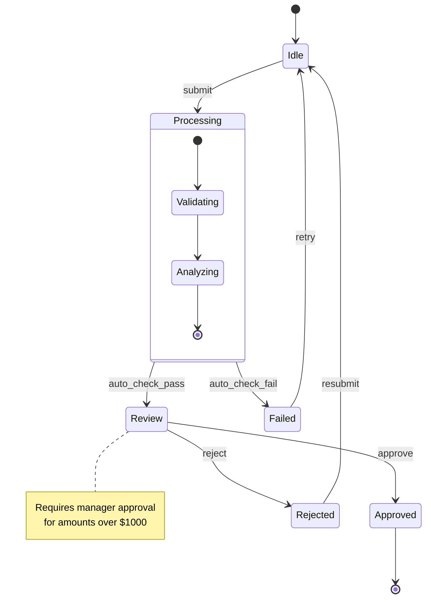
```mermaid
stateDiagram-v2
    [*] --> Idle
    Idle --> Processing : submit
    Processing --> Review : auto_check_pass
    Processing --> Failed : auto_check_fail
    Review --> Approved : approve
    Review --> Rejected : reject
    Approved --> [*]
    Rejected --> Idle : resubmit
    Failed --> Idle : retry

    state Processing {
        [*] --> Validating
        Validating --> Analyzing
        Analyzing --> [*]
    }

    note right of Review
        Requires manager approval
        for amounts over $1000
    end note
```

**Gotchas:**
- Use `stateDiagram-v2` (not v1) for modern syntax
- Composite states (nested) use `state Name { ... }`
- Transitions: `State1 --> State2 : event_label`
- `[*]` represents both start and end states depending on context

---

## Entity Relationship Diagram

**Key elements:** entities, attributes, relationships with cardinality

**Cardinality:**
- `||--||` one-to-one
- `||--o{` one-to-many (zero or more)
- `||--|{` one-to-many (one or more)
- `o{--o{` many-to-many

**Attribute types:** `string`, `int`, `float`, `bool`, `date`, `datetime`
**Key markers:** `PK` (primary key), `FK` (foreign key), `UK` (unique key)

**Example:**
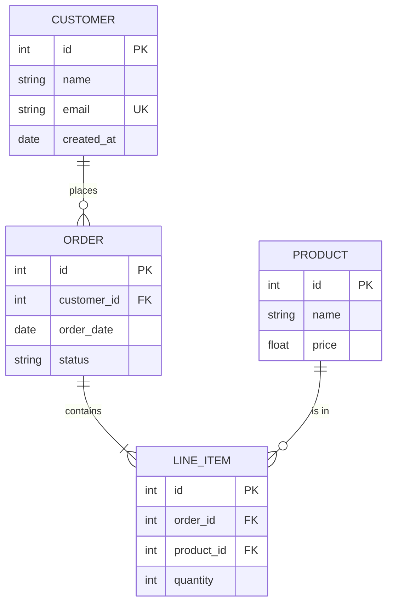
```mermaid
erDiagram
    CUSTOMER ||--o{ ORDER : places
    ORDER ||--|{ LINE_ITEM : contains
    PRODUCT ||--o{ LINE_ITEM : "is in"
    CUSTOMER {
        int id PK
        string name
        string email UK
        date created_at
    }
    ORDER {
        int id PK
        int customer_id FK
        date order_date
        string status
    }
    LINE_ITEM {
        int id PK
        int order_id FK
        int product_id FK
        int quantity
    }
    PRODUCT {
        int id PK
        string name
        float price
    }
```

**Gotchas:**
- Entity names are typically UPPER_CASE (convention)
- Relationship labels must be quoted if they contain spaces: `"is in"`
- Attributes are optional -- entities can be defined without them
- No direction declaration needed

---

## Gantt Chart

**Key elements:** title, dateFormat, sections, tasks

**Task modifiers:** `done`, `active`, `crit` (critical), `milestone`
**Dependencies:** `after taskId`

**Example:**
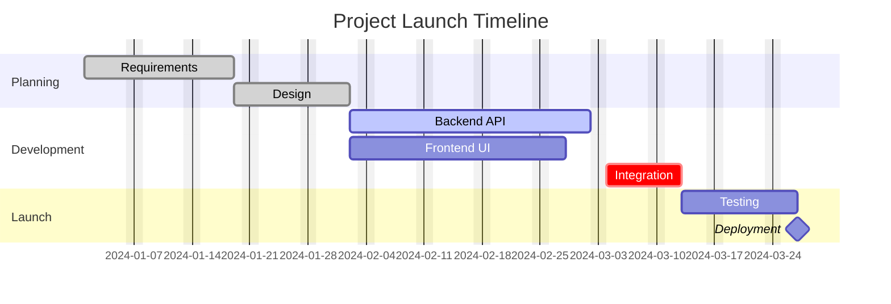
```mermaid
gantt
    title Project Launch Timeline
    dateFormat YYYY-MM-DD
    excludes weekends

    section Planning
        Requirements     :done, req, 2024-01-01, 14d
        Design           :done, design, after req, 10d

    section Development
        Backend API      :active, api, after design, 21d
        Frontend UI      :ui, after design, 18d
        Integration      :crit, integ, after api, 7d

    section Launch
        Testing          :test, after integ, 10d
        Deployment       :milestone, deploy, after test, 0d
```

**Gotchas:**
- `dateFormat` defaults to `YYYY-MM-DD` -- always specify explicitly
- Task duration: `14d` (days), `2w` (weeks), or end date
- Tasks without IDs cannot be referenced by `after`
- `excludes weekends` skips Saturdays and Sundays

---

## User Journey

**Key elements:** title, sections, tasks with satisfaction scores (1-5)

**Example:**
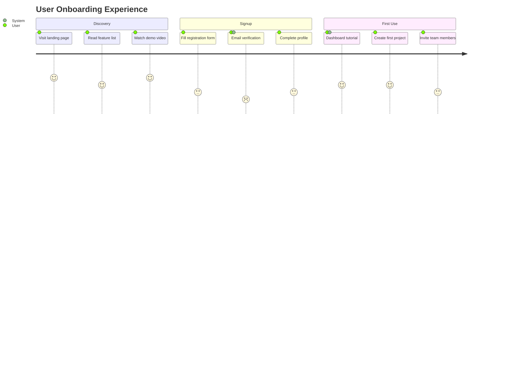
```mermaid
journey
    title User Onboarding Experience
    section Discovery
        Visit landing page    : 5 : User
        Read feature list     : 4 : User
        Watch demo video      : 5 : User
    section Signup
        Fill registration form : 3 : User
        Email verification    : 2 : User, System
        Complete profile      : 3 : User
    section First Use
        Dashboard tutorial    : 4 : User, System
        Create first project  : 4 : User
        Invite team members   : 3 : User
```

**Gotchas:**
- Satisfaction scores: 1 (frustrated) to 5 (delighted)
- Multiple actors separated by commas: `5 : User, System`
- Tasks under a `section` are grouped visually
- Keep task names concise for readability

---

## Git Graph

**Key elements:** commits, branches, checkouts, merges, cherry-picks

**Example:**
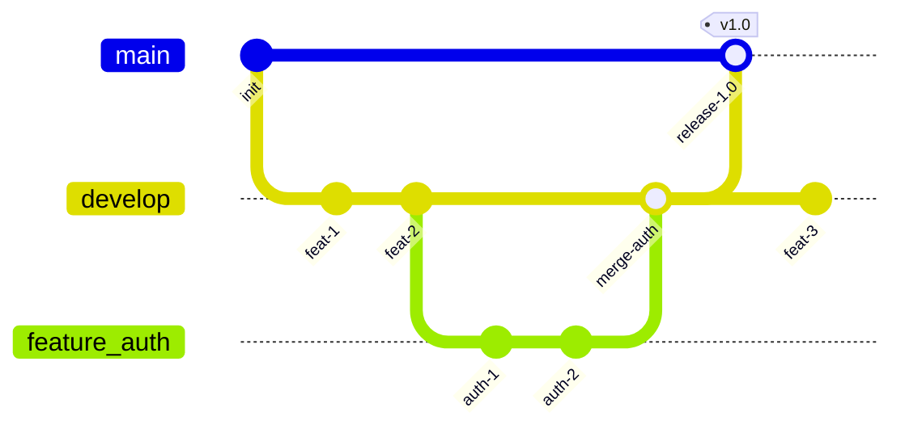
```mermaid
gitGraph
    commit id: "init"
    branch develop
    checkout develop
    commit id: "feat-1"
    commit id: "feat-2"
    branch feature_auth
    checkout feature_auth
    commit id: "auth-1"
    commit id: "auth-2"
    checkout develop
    merge feature_auth id: "merge-auth"
    checkout main
    merge develop id: "release-1.0" tag: "v1.0"
    checkout develop
    commit id: "feat-3"
```

**Gotchas:**
- Branch names cannot contain hyphens: use `feature_auth` not `feature-auth`
- `checkout` switches the current branch for subsequent commits
- `tag:` adds a version tag to a commit
- Merges go INTO the currently checked-out branch

---

## Pie Chart

**Key elements:** title, label-value pairs

**Example:**
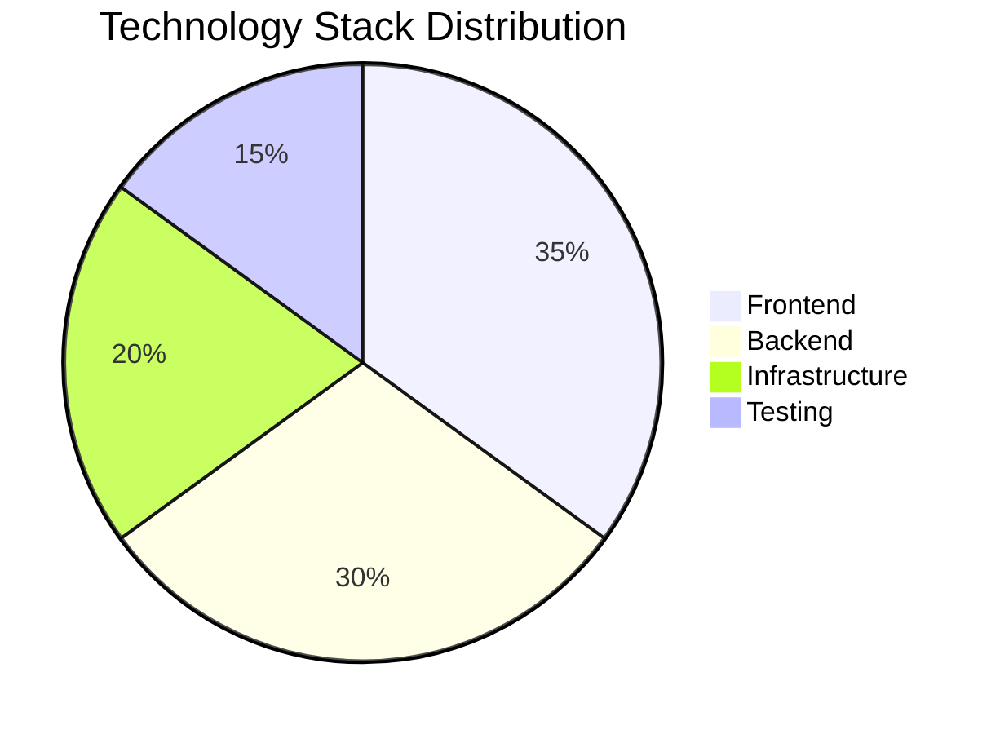
```mermaid
pie title Technology Stack Distribution
    "Frontend" : 35
    "Backend" : 30
    "Infrastructure" : 20
    "Testing" : 15
```

**Gotchas:**
- Labels must be in double quotes
- Values are numeric (percentages or raw numbers -- Mermaid auto-calculates proportions)
- `showData` keyword after title shows values on the chart
- Keep to 3-7 slices for readability

---

## Mindmap

**Key elements:** root node, child nodes via indentation

**Node shapes:**
- `Root` -- default (rectangle)
- `(Rounded)` -- rounded rectangle
- `[Square]` -- square
- `((Circle))` -- circle
- `)Cloud(` -- cloud shape
- `{{Hexagon}}` -- hexagon

**Example:**
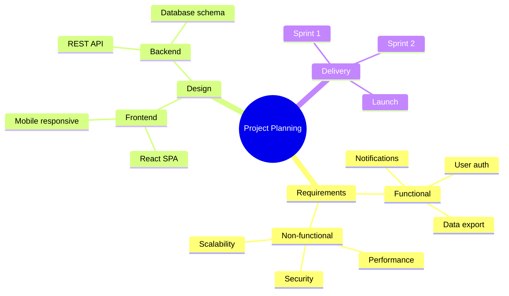
```mermaid
mindmap
    root((Project Planning))
        Requirements
            Functional
                User auth
                Data export
                Notifications
            Non-functional
                Performance
                Security
                Scalability
        Design
            Frontend
                React SPA
                Mobile responsive
            Backend
                REST API
                Database schema
        Delivery
            Sprint 1
            Sprint 2
            Launch
```

**Gotchas:**
- Indentation defines hierarchy (use consistent spaces)
- Root node is required and appears first
- No arrows or explicit connections -- hierarchy is implicit
- Node shapes apply to individual nodes: `((Circle node))`

---

## Timeline

**Key elements:** title, time periods, events

**Example:**
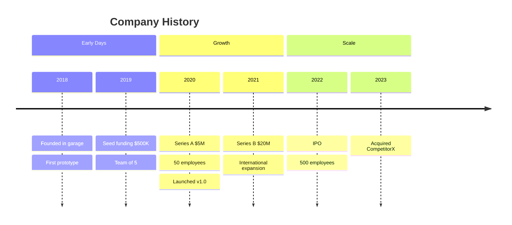
```mermaid
timeline
    title Company History
    section Early Days
        2018 : Founded in garage
             : First prototype
        2019 : Seed funding $500K
             : Team of 5
    section Growth
        2020 : Series A $5M
             : 50 employees
             : Launched v1.0
        2021 : Series B $20M
             : International expansion
    section Scale
        2022 : IPO
             : 500 employees
        2023 : Acquired CompetitorX
```

**Gotchas:**
- Multiple events per time period: indent and use `:` prefix on separate lines
- `section` groups time periods visually
- Time labels can be any text (years, dates, quarters, etc.)
- Keep events concise -- one line per event

---

## Quadrant Chart

**Key elements:** title, axis labels, quadrant labels, data points

**Example:**
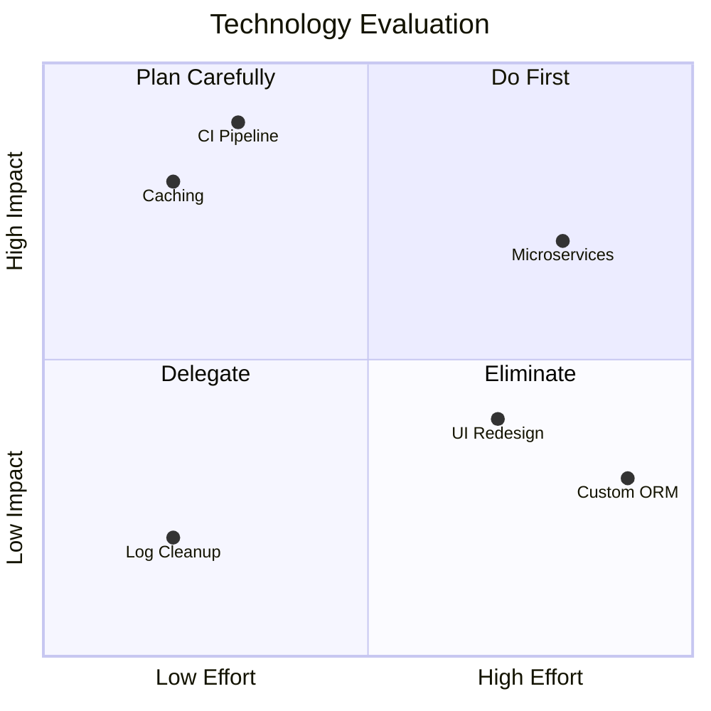
```mermaid
quadrantChart
    title Technology Evaluation
    x-axis Low Effort --> High Effort
    y-axis Low Impact --> High Impact
    quadrant-1 Do First
    quadrant-2 Plan Carefully
    quadrant-3 Delegate
    quadrant-4 Eliminate
    Caching: [0.2, 0.8]
    Microservices: [0.8, 0.7]
    CI Pipeline: [0.3, 0.9]
    UI Redesign: [0.7, 0.4]
    Log Cleanup: [0.2, 0.2]
    Custom ORM: [0.9, 0.3]
```

**Gotchas:**
- Coordinates are [x, y] with values from 0.0 to 1.0
- Quadrant numbering: 1=top-right, 2=top-left, 3=bottom-left, 4=bottom-right
- Axis labels use `-->` to show direction from low to high
- Point labels cannot contain special characters

---

## C4 Diagrams

**Three levels:** C4Context (L1), C4Container (L2), C4Component (L3)

**Key macros:** `Person`, `System`, `Container`, `Component`, `Boundary`, `Rel`

### C4Context Example
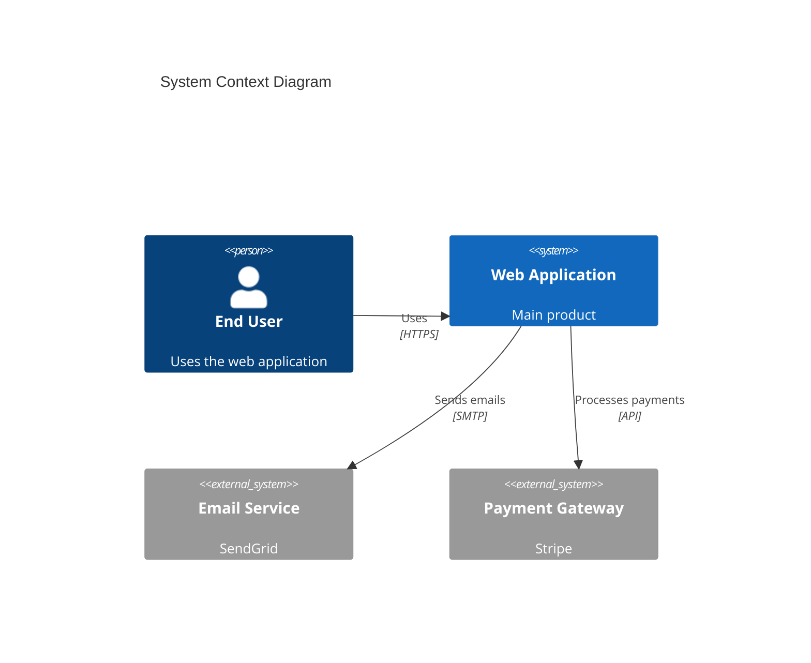
```mermaid
C4Context
    title System Context Diagram

    Person(user, "End User", "Uses the web application")
    System(webapp, "Web Application", "Main product")
    System_Ext(email, "Email Service", "SendGrid")
    System_Ext(payment, "Payment Gateway", "Stripe")

    Rel(user, webapp, "Uses", "HTTPS")
    Rel(webapp, email, "Sends emails", "SMTP")
    Rel(webapp, payment, "Processes payments", "API")
```

### C4Container Example
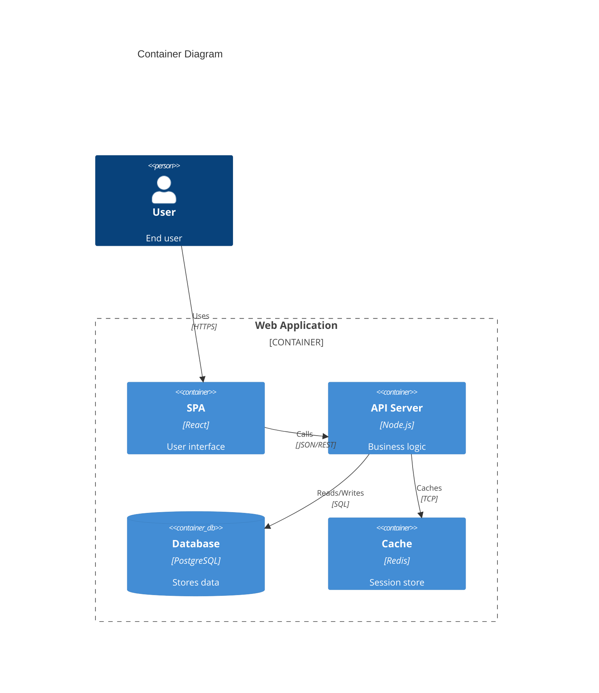
```mermaid
C4Container
    title Container Diagram

    Person(user, "User", "End user")

    Container_Boundary(app, "Web Application") {
        Container(spa, "SPA", "React", "User interface")
        Container(api, "API Server", "Node.js", "Business logic")
        ContainerDb(db, "Database", "PostgreSQL", "Stores data")
        Container(cache, "Cache", "Redis", "Session store")
    }

    Rel(user, spa, "Uses", "HTTPS")
    Rel(spa, api, "Calls", "JSON/REST")
    Rel(api, db, "Reads/Writes", "SQL")
    Rel(api, cache, "Caches", "TCP")
```

**Gotchas:**
- `System_Ext` for external systems, `System` for internal
- `Container_Boundary` groups containers (use `{ }` block)
- `Rel(from, to, label, technology)` defines relationships
- `ContainerDb` for database containers, `ContainerQueue` for message queues

---

## Block Diagram

**Key elements:** columns, blocks, spaces, links, widths

**Example:**
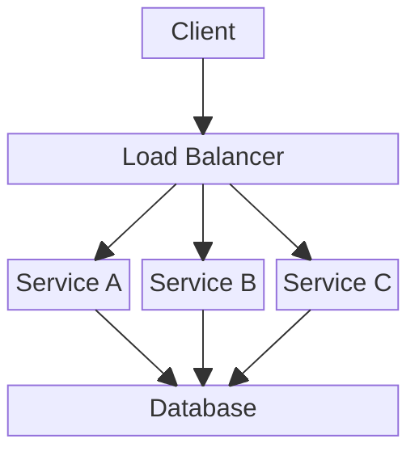
```mermaid
block-beta
    columns 3
    space Client space
    space:3
    A["Load Balancer"]:3
    space:3
    B["Service A"] C["Service B"] D["Service C"]
    space:3
    E["Database"]:3

    Client --> A
    A --> B
    A --> C
    A --> D
    B --> E
    C --> E
    D --> E
```

**Gotchas:**
- `columns N` sets the grid width
- `:N` after a block sets its column span
- `space` creates empty cells, `space:N` spans N columns
- Block IDs follow standard rules (no hyphens)
- Links between blocks use `-->`, `---`, etc.

---

## Sankey Diagram

**Key elements:** source, target, value (CSV-like format)

**Example:**
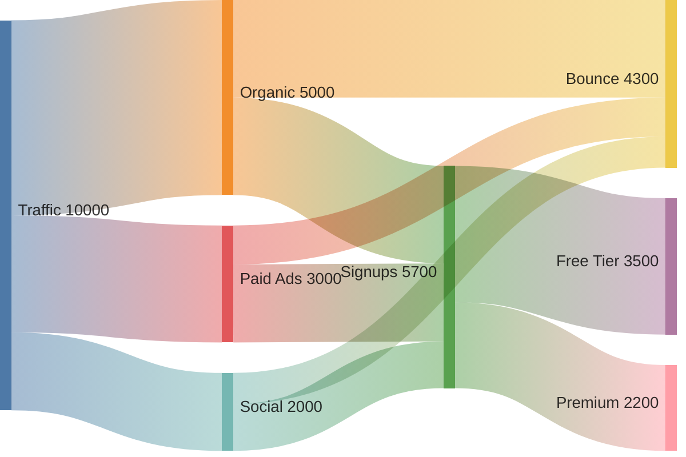
```mermaid
sankey-beta
    Traffic,Organic,5000
    Traffic,Paid Ads,3000
    Traffic,Social,2000
    Organic,Signups,2500
    Organic,Bounce,2500
    Paid Ads,Signups,2000
    Paid Ads,Bounce,1000
    Social,Signups,1200
    Social,Bounce,800
    Signups,Free Tier,3500
    Signups,Premium,2200
```

**Gotchas:**
- Format: `Source,Target,Value` (comma-separated, one per line)
- Values must be positive numbers
- Nodes are automatically created from source/target names
- No explicit node declarations needed

---

## XY Chart

**Key elements:** title, x-axis, y-axis, bar/line data

**Example:**
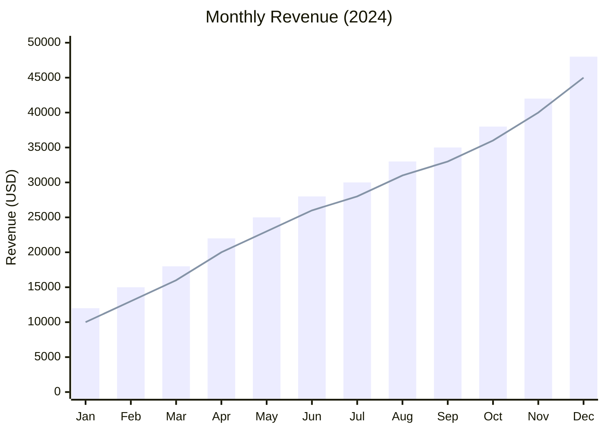
```mermaid
xychart-beta
    title "Monthly Revenue (2024)"
    x-axis [Jan, Feb, Mar, Apr, May, Jun, Jul, Aug, Sep, Oct, Nov, Dec]
    y-axis "Revenue (USD)" 0 --> 50000
    bar [12000, 15000, 18000, 22000, 25000, 28000, 30000, 33000, 35000, 38000, 42000, 48000]
    line [10000, 13000, 16000, 20000, 23000, 26000, 28000, 31000, 33000, 36000, 40000, 45000]
```

**Gotchas:**
- x-axis values in `[ ]` brackets, comma-separated
- y-axis range: `"label" min --> max`
- `bar` and `line` can be combined in the same chart
- Data array length must match x-axis label count

---

## Requirement Diagram

**Key elements:** requirements, elements, relationships

**Requirement types:** `requirement`, `functionalRequirement`, `performanceRequirement`, `interfaceRequirement`, `designConstraint`, `physicalRequirement`

**Risk/verification:** `low/medium/high`, `analysis/inspection/test/demonstration`

**Example:**
```mermaid
requirementDiagram
    requirement auth_req {
        id: REQ-001
        text: System shall authenticate users via OAuth2
        risk: high
        verifymethod: test
    }
    functionalRequirement session_req {
        id: REQ-002
        text: Sessions shall expire after 30 minutes
        risk: medium
        verifymethod: test
    }
    element auth_module {
        type: module
        docRef: auth-module-v2
    }

    auth_module - satisfies -> auth_req
    auth_module - satisfies -> session_req
    auth_req - traces -> session_req
```

**Gotchas:**
- Relationship types: `satisfies`, `traces`, `contains`, `copies`, `derives`, `refines`
- Relationship syntax: `element - type -> requirement`
- `id` and `text` are required fields for requirements
- `docRef` links to external documentation

---

## ZenUML

**Alternative sequence diagram syntax** -- code-like, more readable for developers.

**Example:**
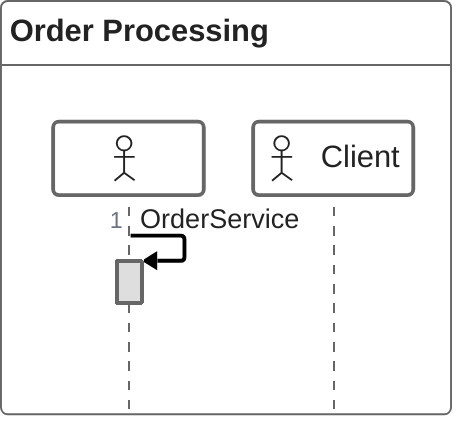
```mermaid
zenuml
    title Order Processing
    @Actor Client
    @Starter OrderService
    @Database OrderDB

    Client->OrderService.createOrder(items) {
        OrderService->OrderDB.save(order) {
            return orderId
        }
        if (orderId != null) {
            return "Order Created"
        } else {
            return "Error"
        }
    }
```

**Gotchas:**
- Uses code-like syntax with `{ }` blocks and `if/else`
- `@Actor`, `@Starter`, `@Database` are participant annotations
- Method calls use dot notation: `Service.method(args)`
- `return` shows response arrows automatically

---

## Architecture Diagram

**Key elements:** groups, services (with icons), edges

**Built-in icon sets:** `cloud`, `database`, `disk`, `internet`, `server`

**Example:**
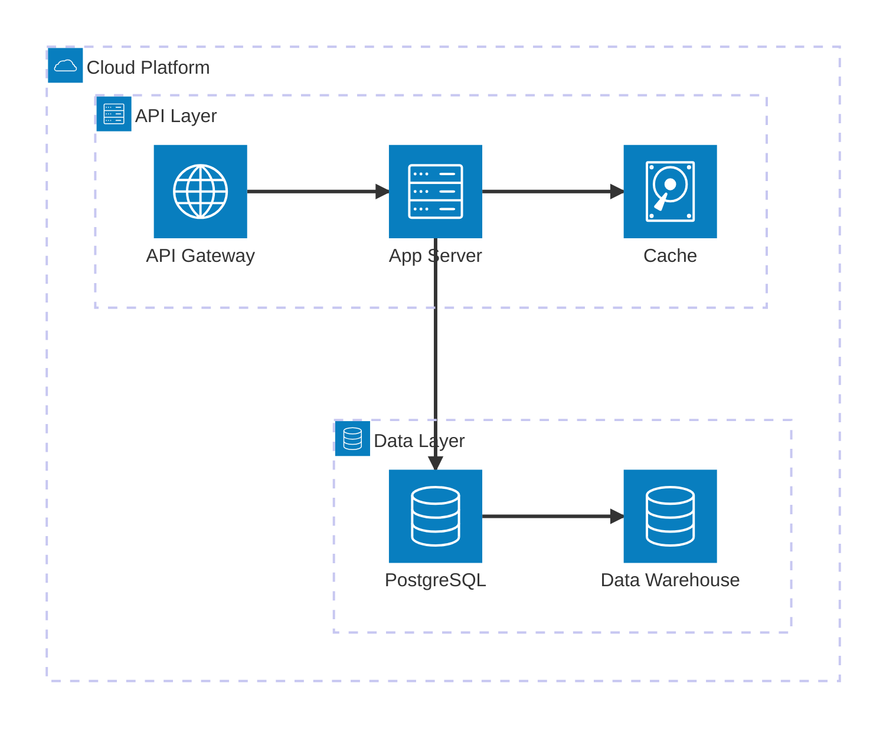
```mermaid
architecture-beta
    group cloud(cloud)[Cloud Platform]
    group api(server)[API Layer] in cloud
    group data(database)[Data Layer] in cloud

    service gateway(internet)[API Gateway] in api
    service app(server)[App Server] in api
    service cache(disk)[Cache] in api
    service db(database)[PostgreSQL] in data
    service warehouse(database)[Data Warehouse] in data

    gateway:R --> L:app
    app:R --> L:cache
    app:B --> T:db
    db:R --> L:warehouse
```

**Gotchas:**
- Edge syntax uses directional ports: `L` (left), `R` (right), `T` (top), `B` (bottom)
- Edge format: `source:PORT --> PORT:target`
- `in groupName` nests a service/group inside another group
- Icon types are predefined -- use parenthetical notation: `service name(icon)[Label]`

---

## Kanban

**Key elements:** columns with items (ticket-style)

**Example:**
```mermaid
kanban
    Backlog
        Design login page
        API rate limiting
        Mobile responsive fix
    In Progress
        User authentication
        Payment integration
    Review
        Search feature
        Email notifications
    Done
        Database migration
        CI/CD pipeline
```

**Gotchas:**
- Column names are top-level (no indentation)
- Items are indented under their column
- No explicit connections between items
- Keep item names concise
- Simple indentation-based syntax (similar to mindmap)
