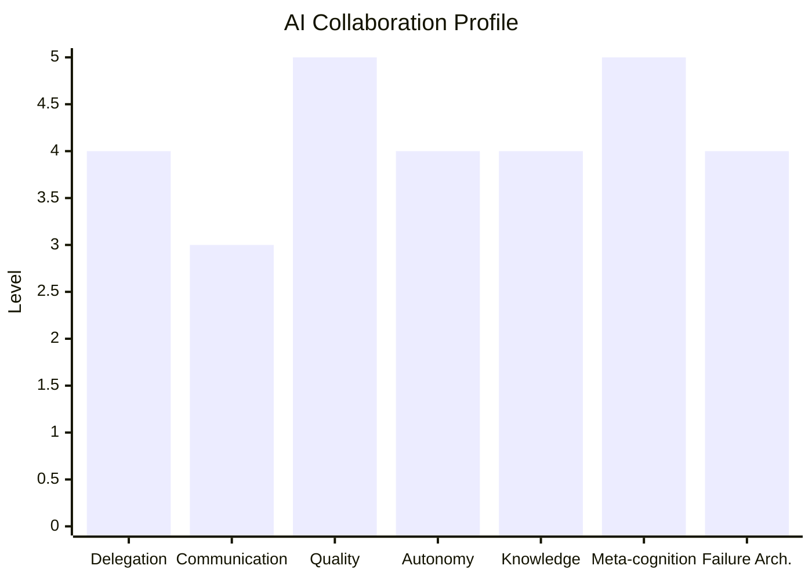

# Meta Profiling — AI Collaboration Style Analyzer

Profile how a developer collaborates with AI. This isn't about what you build — it's about
**how you think, delegate, communicate, and orchestrate** when working with AI.

The output is an evidence-based profile grounded in established cognitive and management
frameworks, not subjective impressions.

## When to Use

- Understanding your own AI collaboration patterns and blind spots
- Team workshops on AI-assisted development practices
- Benchmarking AI adoption maturity across an organization
- Reflecting on how your AI usage has evolved over time
- Any request about: "how do I work with AI?", "analyze my style", "프로파일링"

## Generation Workflow (4 Phases)

> **You are an analytical profiler, not a cheerleader.** Every claim must cite specific
> evidence from the user's configuration, memory, or history. Strengths and blind spots
> both matter. The goal is insight that changes behavior, not flattery.

### Phase 1: Data Collection

Systematically scan all available sources. Not every user will have all of these —
adapt to what exists. The amount of data found itself is a signal (minimal setup vs
extensive customization).

#### Source Priority (scan in this order)

| Priority | Source | What to Extract |
|----------|--------|-----------------|
| 1 | `~/.claude/CLAUDE.md` | Global instructions, rules, preferences, language |
| 2 | `~/.claude/rules/*.md` | Custom behavioral rules and constraints |
| 3 | `~/.claude/agents/*.md` | Custom agent definitions, model choices, role design |
| 4 | `~/.claude/settings.json` | Permission mode, env vars, plugins, effort level |
| 5 | `~/.claude/projects/*/memory/` | All memory files — feedback, user, project, reference types |
| 6 | `~/.claude/skills/*/SKILL.md` | Custom skills the user has built |
| 7 | `.claude/CLAUDE.md` | Project-level instructions |
| 8 | Git log (last 50 commits) | Commit frequency, co-authored patterns, message style |
| 9 | `~/.claude/projects/*/CLAUDE.md` | Project-specific CLAUDE.md files |

```
# Scan pattern (adapt paths to OS)
~/.claude/CLAUDE.md
~/.claude/rules/*.md
~/.claude/agents/*.md
~/.claude/settings.json
~/.claude/projects/*/memory/*.md
~/.claude/projects/*/memory/MEMORY.md
~/.claude/skills/*/SKILL.md (or project skills directories)
.claude/CLAUDE.md
git log --oneline -50
```

#### Collection Output

After scanning, produce an internal inventory (not shown to user):

| Source | Files Found | Signal Density |
|--------|-------------|----------------|
| Global CLAUDE.md | 1 | High / Medium / Low / None |
| Rules | N files | ... |
| Agents | N files | ... |
| Memory | N files across M projects | ... |
| Skills | N skills | ... |
| Settings | 1 | ... |

**Signal Density Guide:**
- **High**: Extensive customization, detailed instructions, clear philosophy
- **Medium**: Some customization, functional but not deeply personalized
- **Low**: Minimal configuration, mostly defaults
- **None**: Source doesn't exist

The overall amount of customization is itself a data point — a user with 7 custom agents,
6 skills, and 50+ memory files has a fundamentally different relationship with AI than
someone using defaults.

### Phase 2: 7-Dimension Pattern Analysis

Analyze the collected data across 7 dimensions. Each dimension has specific indicators
to look for. See `references/analysis-dimensions.md` for detailed rubrics and scoring.

| # | Dimension | Core Question |
|---|-----------|---------------|
| 1 | Delegation Architecture | How do they distribute cognitive work to AI? |
| 2 | Communication Style | How do they instruct, correct, and confirm? |
| 3 | Quality Standards | What does "done" mean to them? |
| 4 | Autonomy Spectrum | How much freedom do they grant AI? |
| 5 | Knowledge Management | How do they preserve context across sessions? |
| 6 | Meta-cognitive Depth | Do they think about HOW they work, or just WHAT? |
| 7 | Failure Architecture | How do they handle and prevent AI mistakes? |

For each dimension, assign a level (1-5) based on evidence:

```
1 = Default    — No customization in this area
2 = Aware      — Some configuration, basic understanding
3 = Deliberate — Intentional patterns, clear reasoning
4 = Systematic — Frameworks, reusable structures, cross-session consistency
5 = Generative — Creates tools/methods that others can use, teaches/shares
```

**Important**: Levels are descriptive, not judgmental. A "1" in Delegation Architecture
might be perfectly appropriate for someone who uses AI for simple Q&A. Level 5 isn't
universally "better" — it's more invested, which has trade-offs (complexity, maintenance).

### Phase 3: Methodology Mapping

Map discovered patterns to established academic and industry frameworks.
See `references/methodology-catalog.md` for the full catalog.

The goal isn't to force-fit frameworks — it's to give the user a vocabulary for what
they're already doing intuitively, and to connect them to bodies of knowledge that
could deepen their practice.

**Mapping Rules:**
- Only map frameworks where there's genuine alignment (not surface-level keyword match)
- Cite specific evidence for each mapping ("Your Council Pattern maps to De Bono's
  Six Thinking Hats because...")
- Note where the user's practice diverges from the framework — that's often the most
  interesting insight
- Include at least 3, at most 7 framework mappings

### Phase 4: Profile Generation

Generate `AI_COLLABORATION_PROFILE.md` in the current working directory.

#### Profile Structure

```markdown
# AI Collaboration Profile

> Generated: {date} | Sources analyzed: {count} files across {count} projects

## Executive Summary
(3 sentences capturing the essence of how this person works with AI)

## Archetype: {Archetype Name}
(One-paragraph description. See references/archetype-catalog.md for options,
but create a custom archetype if none fits well.)

## 7-Dimension Analysis

### Radar Overview
(Mermaid xychart or text-based visualization)

### 1. Delegation Architecture — Level {N}/5
**Evidence:** (cite specific files/configurations)
**Pattern:** (describe what they do)
**Insight:** (what this reveals about their thinking)

### 2. Communication Style — Level {N}/5
(same structure)

... (all 7 dimensions)

## Methodology Mapping

### {Framework Name} — {How It Applies}
(For each mapped framework: what it is, how the user's practice maps to it,
where they diverge, and what they could learn from deeper engagement)

## Strengths
(3-5 specific strengths with evidence)

## Blind Spots
(2-3 areas for potential growth — framed constructively, always with
concrete suggestions)

## Recommendations
(3-5 actionable next steps to evolve their AI collaboration practice)

## Evidence Index
(List of all sources analyzed with brief notes on what each contributed)
```

#### Language

- Detect primary language from CLAUDE.md / memory files
- If Korean content predominates → write profile in Korean
- If English → write in English
- If mixed → write section headers in English, content in the predominant language

#### Visualization

For the radar chart, use Mermaid xychart if available:



If Mermaid is not suitable, use a text-based visualization:

```
Delegation    ████████░░  4/5
Communication ██████░░░░  3/5
Quality       ██████████  5/5
Autonomy      ████████░░  4/5
Knowledge     ████████░░  4/5
Meta-cognition██████████  5/5
Failure Arch. ████████░░  4/5
```

## Adaptive Depth

The profile depth should match the data richness:

| Data Richness | Profile Depth | Approximate Length |
|---------------|---------------|-------------------|
| Minimal (defaults only) | Basic profile + recommendations for getting started | ~500 words |
| Moderate (some config) | Standard profile with partial dimension analysis | ~1500 words |
| Rich (extensive config) | Full profile with all sections | ~3000 words |
| Power user (agents, skills, memory) | Deep profile with methodology mapping | ~5000 words |

Don't pad thin data with speculation. If evidence is sparse, say so — the gap itself
is informative.

## Reference Files

Load these as needed during analysis:

| File | When to Load | Contents |
|------|-------------|----------|
| `references/analysis-dimensions.md` | Phase 2 | Detailed rubric for each dimension with scoring criteria and indicator lists |
| `references/methodology-catalog.md` | Phase 3 | Academic and industry frameworks with mapping rules |
| `references/archetype-catalog.md` | Phase 4 | Predefined archetype patterns with matching criteria |
